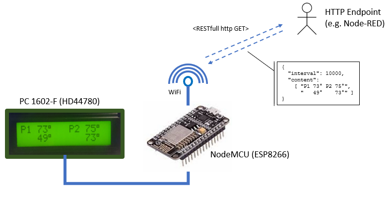

# WiFi Status LCD

A very simple wifi-based status display, which queries its content from an http server and drives a 
Liquid Crystal Display (LCD) with [Hitachi HD44780 LCD controller](https://de.wikipedia.org/wiki/HD44780). 
For example, it can be used together with Node-RED as a low-cost visualization.
An ESP8266 ESP-12E NodeMcu WiFi board is used for connectivity. 

## Usage
After boot, the controller continuously queries a given server url.
The server needs to respond with a json object in the following format:
	
	{ 
	  "content": [
		"row0 text",
		"row1 text"
		...
		]
	  "interval": 10000,
	  "sessionId": 0,                     
	  "url": "http://xxx.yyy/aaa/bbb" 
	}
	
Description:
 * `content`: Array of strings with the content for each row of the display.
 * `interval`: Optional element which describes the delay in milliseconds for the next query.
 * `sessionId`: Optional. A session id which will be appended as argument to the url. Can be used to identify and distingish multiple client sessions.
 * `url`: Optional. The url for the next query.
 
The contents will be written to the display and the server will be queried again in the next interval using the optional given url.

### Node-RED Example
This is an example of a flow which shows "hello world" on the display.

	[{"id":"5e9eb492.b382b4","type":"http in","z":"c1c45f7f.3fbae","name":"","url":"/displays/example","method":"get","upload":false,"swaggerDoc":"","x":240,"y":280,"wires":[["cdf3587e.b528e"]]},{"id":"dafe4b3d.266f8","type":"http response","z":"c1c45f7f.3fbae","name":"","statusCode":"","headers":{},"x":890,"y":280,"wires":[]},{"id":"3557d414.5b345c","type":"change","z":"c1c45f7f.3fbae","name":"Set Headers","rules":[{"t":"set","p":"headers","pt":"msg","to":"{}","tot":"json"},{"t":"set","p":"headers.content-type","pt":"msg","to":"application/json","tot":"str"}],"action":"","property":"","from":"","to":"","reg":false,"x":710,"y":280,"wires":[["dafe4b3d.266f8"]]},{"id":"cdf3587e.b528e","type":"function","z":"c1c45f7f.3fbae","name":"Create message","func":"\nmsg.payload = {\n    interval: 10000,\n    content: [\n        \"Hello\", \n        \"World!\"\n        ]\n};\n\nreturn msg;","outputs":1,"noerr":0,"x":490,"y":280,"wires":[["3557d414.5b345c"]]}]
	
In the source code for the ESP8266 you need to configure the URL to query for `http://<node-red-ip>/displays/example`.
 

## Build instructions

### Firmware
To build the arduino sketch:

- Install Arduino IDE
  - Use the Arduino Board Manager to install the ESP8266 toolchain (https://github.com/esp8266/Arduino) 
  - Use the Arduino Library Manager to install ArduinoJSON (https://bblanchon.github.io/ArduinoJson/)
- Open the sketch and modify the settings in the `config.h` header. You have to set the SSID and password of your wifi network as well as the URL to query for the content.
- Compile and download to nodemcu.
 

## History
- 2018-jan-28: 1.0.0 - Created first version.

## Credits
- Sebastian Krauskopf (sebakrau)

## License
The MIT License (MIT)

Copyright (c) 2018 sebakrau

Permission is hereby granted, free of charge, to any person obtaining a copy
of this software and associated documentation files (the "Software"), to deal
in the Software without restriction, including without limitation the rights
to use, copy, modify, merge, publish, distribute, sublicense, and/or sell
copies of the Software, and to permit persons to whom the Software is
furnished to do so, subject to the following conditions:

The above copyright notice and this permission notice shall be included in all
copies or substantial portions of the Software.

THE SOFTWARE IS PROVIDED "AS IS", WITHOUT WARRANTY OF ANY KIND, EXPRESS OR
IMPLIED, INCLUDING BUT NOT LIMITED TO THE WARRANTIES OF MERCHANTABILITY,
FITNESS FOR A PARTICULAR PURPOSE AND NONINFRINGEMENT. IN NO EVENT SHALL THE
AUTHORS OR COPYRIGHT HOLDERS BE LIABLE FOR ANY CLAIM, DAMAGES OR OTHER
LIABILITY, WHETHER IN AN ACTION OF CONTRACT, TORT OR OTHERWISE, ARISING FROM,
OUT OF OR IN CONNECTION WITH THE SOFTWARE OR THE USE OR OTHER DEALINGS IN THE
SOFTWARE.
